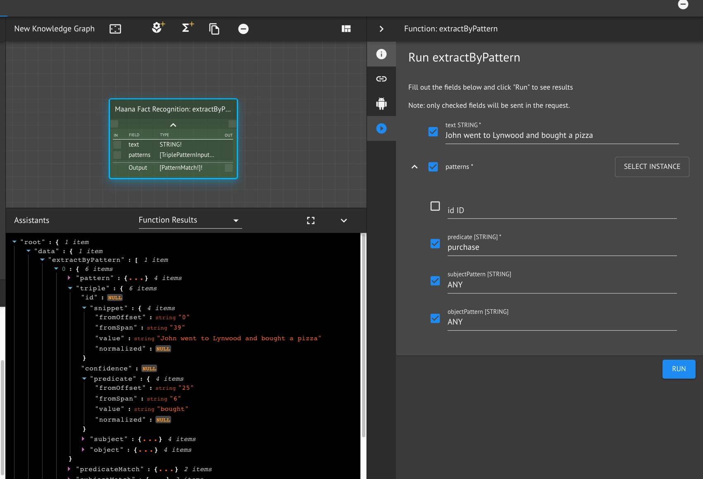
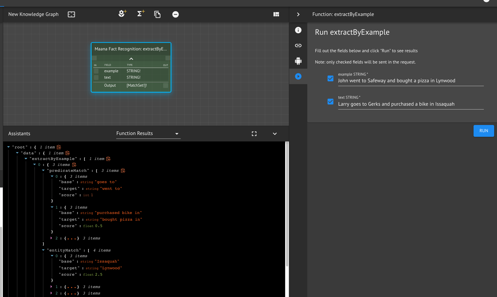

# Fact Recognition Tutorial

## About this Tutorial 

This tutorial specifically reviews the major uses of Fact Recognition Service. This services is a "[Logic Service](../../../product-guide/reference-guide/q-platform-and-microservices/service-types/logic-services.md)," which means that it has no interaction with platform storage or Kinds; it only deals with explicit text inputs \(as opposed to looking up platform Kinds by their ID and performing fact extraction on the corresponding fields. For this functionality please see the [next tutorial](creating-a-fact-recognition-bot.md)\). Therefore, while fact recognition is not a stand-alone service, it can be an important part of an information extraction pipeline. 

The various queries can be used as part of function composition, so the output of one query can be used as the input of another. The examples below show basic use inside the function graph. In each case:

1. Use the service inventory for Maana Fact Recognition and drag the functions to the knowledge graph.
2. Next, press the arrow button on the right hand panel to bring up the function input window.
3. Drag "extractTriples" onto the graph. extractTriples extracts relations from the given string. For example "Alex bought a bike" has subject "Alex", object "bike" and action "bought".

### When might you want to use it 

You may want to use these services if have unstructured text and want to extract person names, locations, or organizations. In addition one can extract how people, locations, organizations ... are related to each other using the information extraction.

## How to run/invoke it 

The various queries can be used as part of function composition, so the output of one query can be used as the input of another. The examples below show basic use inside the function graph. In each case:

1. Use the service inventory for Maana Fact Recognition and drag the functions to the knowledge graph.
2. Next, press the arrow button on the right hand panel to bring up the function input window.
3. Drag "extractTriples" onto the graph. extractTriples extracts relations from the given string. For example "Alex bought a bike" has subject "Alex", object "bike" and action "bought".

### EX 1: The query below extracts the relation "Alex","bought","bike": 

1. Drag "extractByPattern" onto the graph.
2. ExtractByPattern applies a filter on top of extractTriples.

### EX 2: Using Patterns List to Return Triples  

In the example below the patterns list is used to only return triples \(subject, action, object\) that match the given pattern class. In the query below the pattern to match is {predicate : \["purchase"\], subjectPatterns : \["ANY"\], objectPatterns : \["ANY"\]} which is a filter that will match an action similar to "purchase", in this case "bought" and then match any subject and object.

1. Drag "extractByExample" onto the graph.
2. ExtractByExample uses an example sentence - computes the various triples within that sentence and then uses that as a pattern. The pattern is applied to the given "text" and returns matches if they are found.

### Ex 3: Query Matching 

In the example below, the query will match "John" to "Larry", "went" to "goes", "safeway" to "gerks", "pizza" to "bike" and "Lynwood" to "Issaquah".

