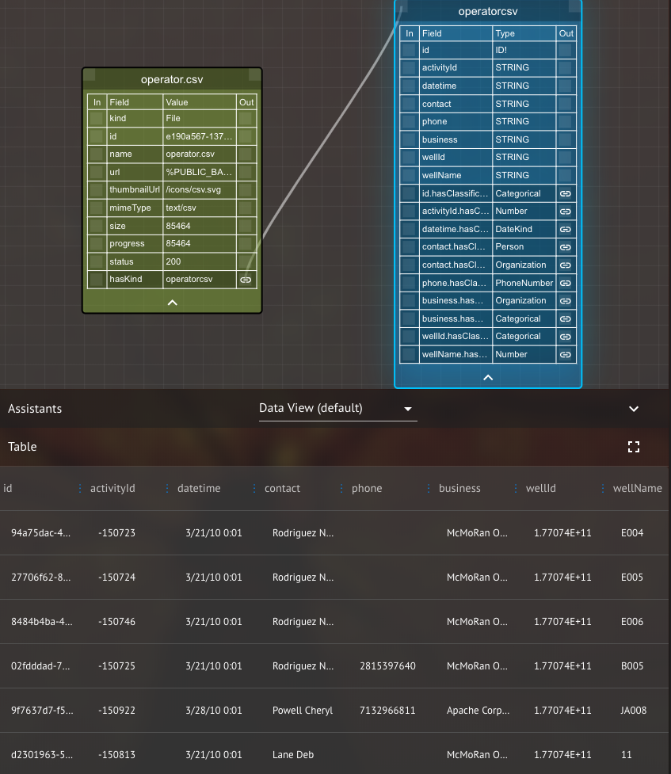
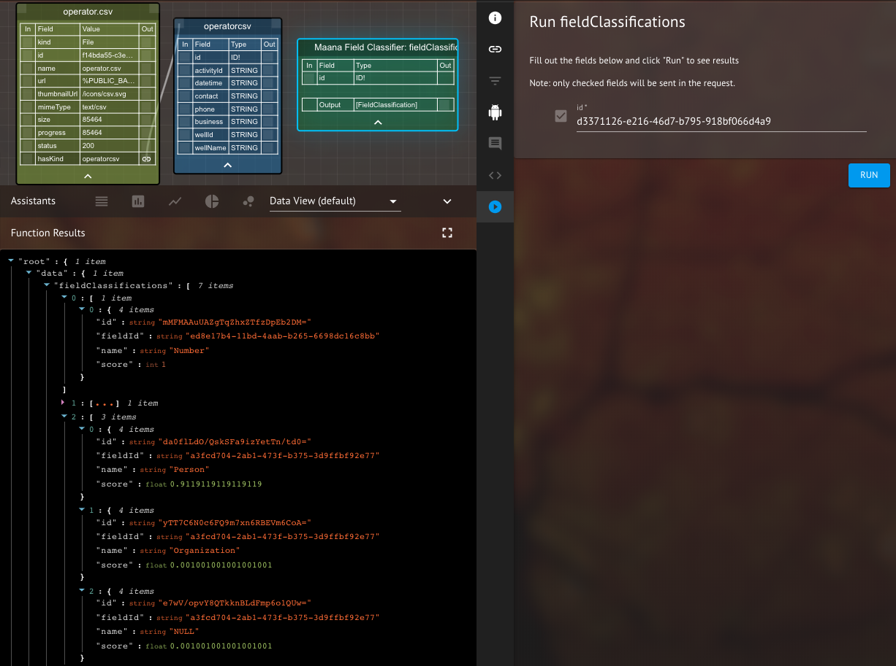
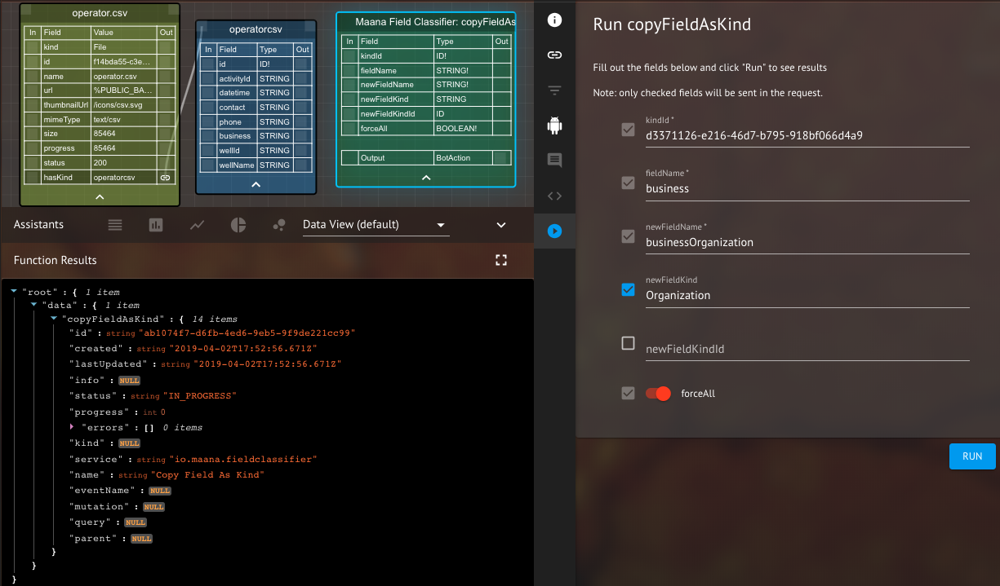
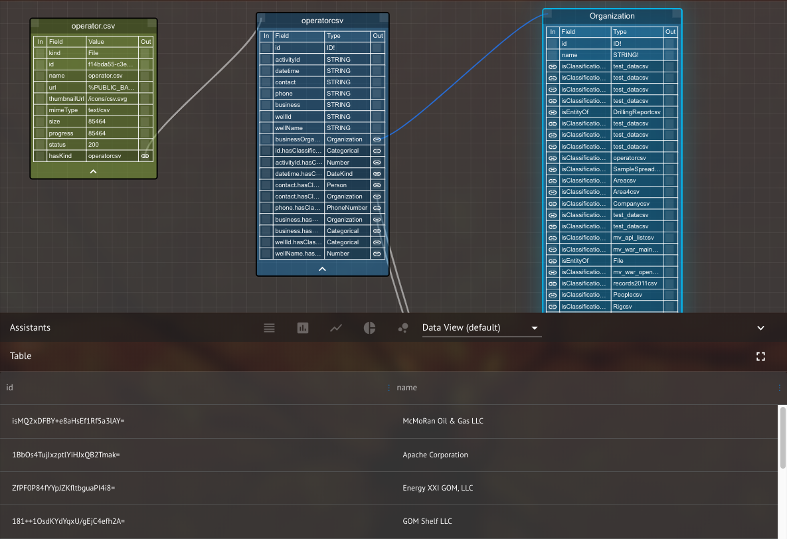

# Function Composition Tutorial

## About this Tutorial 

The Field Classifier service is a tool for classifying fields in tabular data. It also allows you to query the classifications of those fields and add additional columns to the table with the explicit type \(given by the classification\). Explicit types are sometimes needed during function composition to allow data to be used with certain functions.

The Field Classifier relies on the Maana Natural Language Processing service and can only classify fields with the types defined there. However, one can manually define their own classification for a column by creating a new kind with the desired name \(the name should be the same as the classification\) and using the "copyFieldAsKind" function to copy data to that kind \(more on that later\).



## Field Classifier Using Function Composition 

1. To start with, upload a CSV file, in this case use operator.csv \(attached above\).

2. Classify fields in the "operatorcsv" kind. The fields are automatically run through the "classifyFields" query on upload, so this step is not necessary, but shows how the function works.

3. In the services inventory drag the classifyFields function onto the graph from the Field classifier.

4. Click on the arrow button in the right hand panel to open the classifyFields input pane \(classifyFields needs to be selected for this to appear\).

5. Fill in the input parameter with the kindId from the "operatorcsv" kind and click the "run" button.

The results should be as shown below.

**NOTE** If you do not have "Subscribe to Links" toggled in the top right account menu, you must refresh the browser to see the added links.

6. Next, lets see what the field classifications actually are by dragging the "fieldClassification" function onto the workspace.

7. Again in the run panel, copy the kind id for "operatorcsv" into the id field and click run.

The field classifications will appear in the bottom panel as shown below.

8. Now that the fields are classified, define a field as a particular kind.

9. Drag the "copyFieldAsKind" function onto the workspace.

10. The input panel has fields "kindId", "fieldName", "newFieldName", "newFieldKind" and "newFieldKindId". In this case use "newFieldKind" and ignore "newFieldKindId".

11. Use the kindId defined for "operatorcsv", the "fieldName" is one of the existing field names in "operatorcsv". In this case, choose the field "business", the "newFieldName" is the name of the new field that will be added to the "operatorcsv" kind - set this to "businessOrganization", though it can be anything consisting of alpha numeric characters.

12. The next field is "newFieldKind", this is the "kind" that you want use to classify the data. The "newFieldKind" must be the name of a kind that exists in Maana, furthermore if the kind is not a "system kind" then one should use newFieldKindId \(and use the id of the kind\) instead of "newFieldKind".

13. The final option is a switch, "forceAll". When forceAll is switched on all the entries from "fieldName" are added to the new column regardless of individual classification. If "forceAll" is set to false, only those column entries that are classified as the type given in "newFieldKind" or "newFieldKindId" are copied into the new column.

14. Click the run button to see the result \(which is a [botAction](../../../product-guide/reference-guide/technical-design-and-architecture/bot-actions/) indicating the status of the mutation\).The values entered are shown in the image below:

15. After running copyFieldAsKind and waiting for the Bot Action to complete, refresh the browser. A new column will be added to the kind, the image below shows the new column "businessOrganization" which contains ids which are ids of instances in the kind "Organization":

16. Finally, on the "operatorcsv" kind, click on the "Organization" link. This should bring up the organization kind. You will see a blue line from "businessOperator" to "Organization" and the contents of Organization will be the as those contained in the "business" column \(with the caveat that other services may have written to the organization kind as well\).

The copyFieldAsKind not only works on classifications produces by the classifyFields functions, it also works for a user defined kind, provided that \(1\) newFieldKindId is used instead of newFieldKind \(2\) the user defined kind should have a field called "name" and \(3\) if the kind does not have the same name as one of the possible field classifications then the "forceAll" button should be set to true.

