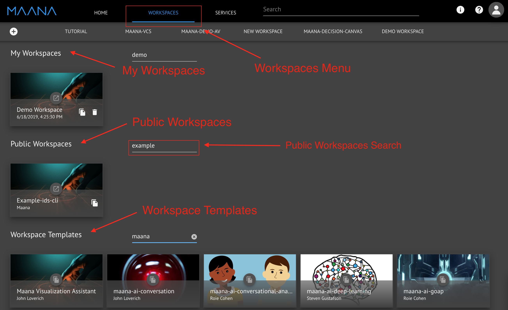

# Workspaces

## What is a Workspace?

A workspace is a dedicated place within the Q portal where you can build, visualize and explore your Maana Computational Knowledge Graph, or CKG. The Q portal features a tab called **Workspaces**, where you can find:

* **My Workspaces** – This area displays the workspaces that you have previously created.
* **Public Workspaces** – This area displays the workspaces that are available for anyone to view or edit.
* **Workspace Templates** – This area can be used to create a new workspace from an existing template.


Only the first 100 Workspaces are shown in each section. If you are unable to find the Workspace you are looking for, try searching for it by name using the Search within the appropriate section.


Within the Workspaces view you can:

* Open or clone workspaces within My Workspaces and Public Workspaces
* Clone Workspace Templates
* Delete workspaces that you created

Think of the workspace as your notebook, like actual physical place that you make notes in and think of a knowledge graph as a page in that notebook.  A workspace is a unit of work \(a container\) for kinds and functions. Each workspace is also a service, callable via GraphQL. And, each workspace can have knowledge graphs and function graphs.

