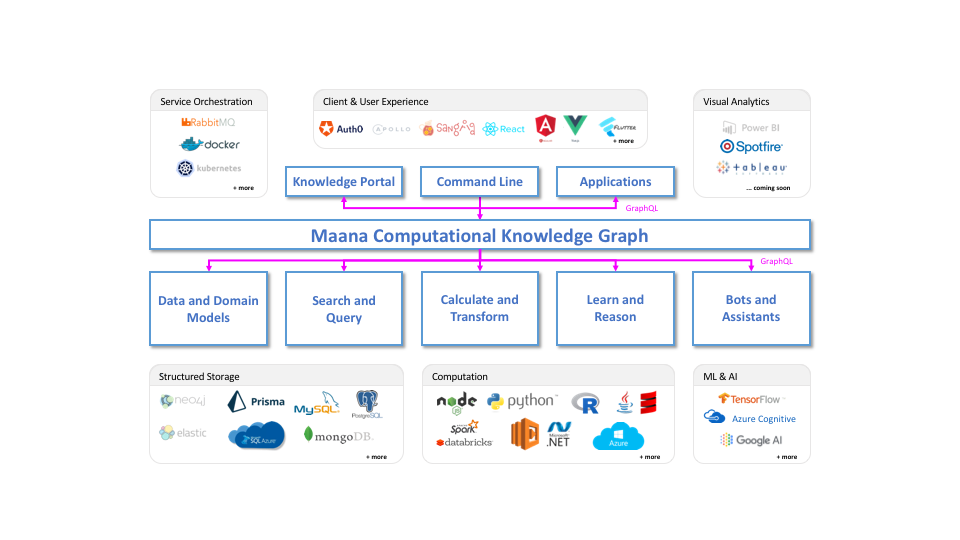
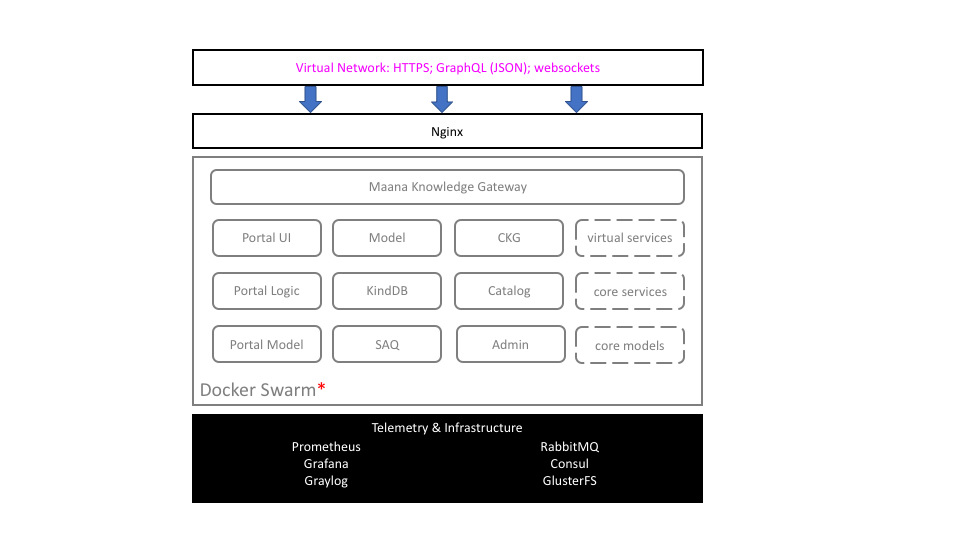
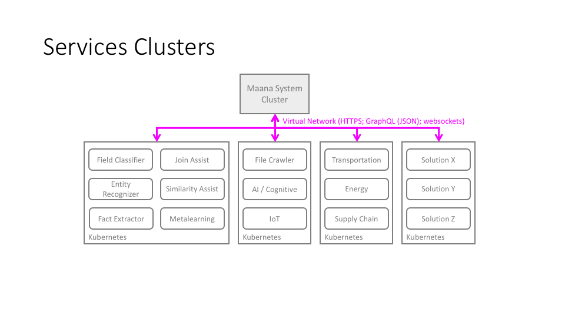

# Platform Architecture and Capabilities

### Maana High Level Computational Knowledge Graph Architecture

Maana enables the development of complex solutions using a visual authoring environment, with preferred languages, frameworks, and tools, which can then be deployed to run at scale.

### Maana System Services Architecture

* Maana Knowledge Gateway
  * Stateless \(scaleout\)
  * AuthN and AuthZ \(RBAC\)
  * Dynamic routing
* Maana Knowledge Portal UI \(3-tier\)
  * Visual solution authoring, analysis, and collaboration
* Maana GraphQL Persistence
  * CRUD "boilerplate" \(paged, secure\) 
  * KindDB + SAQ \(distributed, integrated search\)
* Maana Computational Knowledge Graph
  * Orchestration \(function composition\) 
  * Dependency Management \(import/export\) 
  * Workspace-as-a-Service \(visual authoring\) 
  * Notebook-as-a-Service \(scripting\) 
* Maana Platform Administration \(user, tenant, scale\) 
* Maana Platform Base Install \(models, services\) 
* Pluggable telemetry stack

### Maana Solution Services Cluster Architecture

\[TBD\] Content: @Derek & @Tim

* Links
* Bot Actions
* Eventing
* Logging, Metrics & Alerting
* Function Composition - Details 
* Domain Modeling - Model schemas?
* Search - Limitations, How
* 

